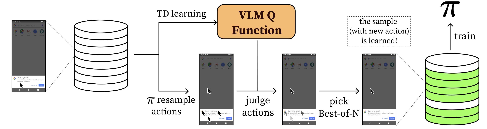
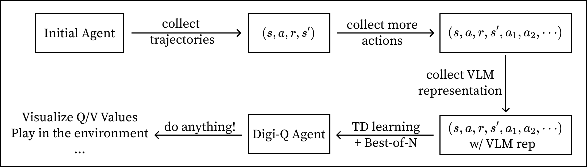
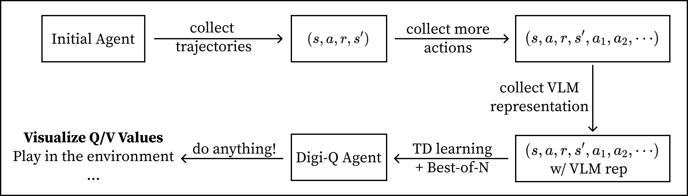
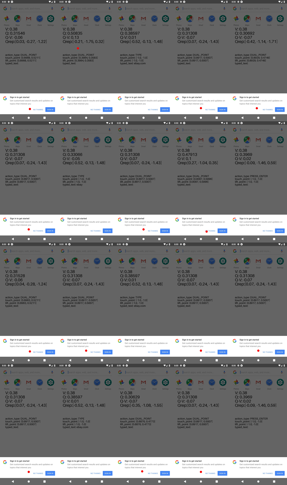
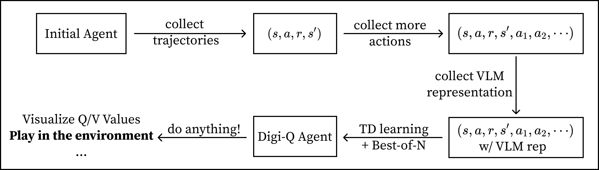
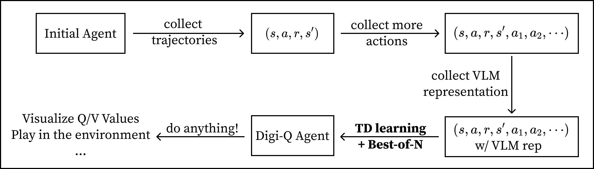
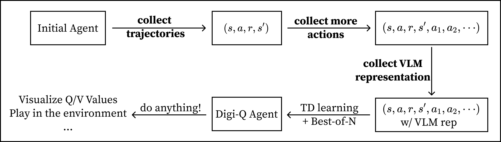

<p align="center">
    
</p>

<h3 align="center">
Digi-Q: Learning VLM Q-Value Functions for Training Device-Control Agents
</h3>

<p align="center">
| <a href="https://digirl-agent.github.io/DigiQ-agent.github.io/"><b>Website | Demo | Results</b></a> | <a href="https://digirl-agent.github.io/DigiQ-agent.github.io/website/data/digiq.pdf"><b>Paper</b></a> | <a href="https://huggingface.co/collections/JackBAI/digi-q-67a8b0f83a24e14cbfd1fbc6"><b>Checkpoints | Data</b></a> |
</p>

---

Research Code for preprint "Digi-Q: Learning VLM Q-Value Functions for Training Device-Control Agents".

[Hao Bai*](https://jackgethome.com), [Yifei Zhou*](https://<username>02.github.io/), [Erran Li](https://www.cs.columbia.edu/~lierranli/), [Sergey Levine](https://people.eecs.berkeley.edu/~svlevine/), [Aviral Kumar](https://aviralkumar2907.github.io/)<br>
UC Berkeley, UIUC, Amazon, CMU
<br>
*Equal contribution

## Method Overview

Digi-Q is a method for training device-control agents with reinforcement learning. The method is based on the idea of learning a value function that can predict the value of a state-action pair in a device-control environment. Reliably predicting these values opens the door to re-ranking some newly proposed actions from the actor and thus learning the best one. This method saves significant amount of (s, a) pairs and allows the agent to learn from a small amount of data, thus made offline:



**This repository structure the workflow as below:**



## 👅 1. First of All, Have a Taste on the Q/V Values!



Before diving into training the agent, we would like to show you how the Q values look like, obtained from the agent we trained.

### 1.1 Dependencies

First, create a [conda](https://conda.io/projects/conda/en/latest/user-guide/install/index.html) environment of version 3.10.0 and install all pip package requirements.

```bash
conda create -n digiq python==3.10.0
conda activate digiq

git clone https://github.com/DigiRL-agent/digiq.git
cd digiq
pip install -e .
```

### 1.2 Download the Agent and Data

The final agent shown in the paper is released through HuggingFace. We release the best agent we trained on the AitW Web Shopping (`webshop`) and AitW General (`general`) task sets. 

| File Name | Test Set Score | File Size | Download Link |
|-----------|----------------|-----------|--------|
| `aitw-webshop-digiq-agent` | 70.8 | 8G | [HF](https://huggingface.co/JackBAI/aitw-webshop-digiq-agent) |
| `aitw-general-digiq-agent` | 59.4 | 8G | [HF](https://huggingface.co/JackBAI/aitw-general-digiq-agent) |

You can download the agent by running the following command:

```bash
git lfs install
git clone <HF_link_above>
```

The two agents above are post-trained by Digi-Q. You also need to download the original AutoUI agent (the base agent used to train the Digi-Q agent). You can do this through:

```bash
wget https://huggingface.co/cooelf/Auto-UI/resolve/main/Auto-UI-Base.zip
unzip Auto-UI-Base.zip
```

After downloading the agents, you should download the data in order to visualize the Q and V values. All these data can be found on [HuggingFace](https://huggingface.co/datasets/JackBAI/autoui-zeroshot-trajectories/tree/main). These trajectories are collected by the [AutoUI agent](https://arxiv.org/abs/2309.11436). After collecting the raw data, we trained a LLaVA model with contrastive target, then obtain the representations and store in these data.

| File Name | #Trajectories | Horizon | File Type| File Size |
|-----------|---------------|---------|----------|-----------|
| `general-1008trajs.pt` | 1008 | 10 | Trajectory with pointer to images | 7G |
| `general-images.zip` | 1008 | 10 | Images | 3G |
| `webshop-1296trajs.pt` | 1296 | 20 | Trajectory with pointer to images | 14G |
| `webshop-images.zip` | 1296 | 20 | Images | 6G |

After downloading the image data, unzip them to directories.

```bash
unzip general-images.zip
unzip webshop-images.zip
```

### 1.3 Visualize the Q and V Values Predicted by the Agent

We provide two Python scripts to visualze the values predicted by the agent. The first one is a trajectory viewer, which allows you to view the whole trajectory of a given index. The second one is an action viewer, which allows you to view the Q/V values of a given action in a given state. You should first modify these fields in `vis/view.sh`:

```bash
agent_path="<path_to_agent>"
data_path="<path_to_data>"
image_path="<path_to_images>"
autoui_path="<path_to_autoui_ckpt>"
hf_cache_path="<path_to_hf_cache>"
```

and then launch it through:

```bash
cd vis
bash view.sh
```

The script above will launch the two visualizers at the same time. You can also launch them separately.

**How can we use these scripts?** After you launch the command above, you will see two gradio links printed out. Open them on your browser. You will see one gradio with title "Trajectory Viewer (Trajectory-level, Single Action)" and the other "Action Viewer (Step-level, Multiple Actions)". 

Now play with the **Trajectory Viewer**. To start with, just input the trajectory you would like to view. For example, if you're interested in visualizing trajectory indexed 120 in `webshop-1296trajs.pt`, simply input `120` into the Index field of the gradio interface, and you will be able to see:


Now select the step you feel interesting, and take down its trajectory ID and step ID. For example, if you're interested in step 1 of the trajectory (the second image in the first row), then open the **Action Viewer** and input trajectory ID `120` and step ID `1`. Also identify how many actions you're interested in (we recommend a smaller number such as `8` or `20` to make visualization quick, but you can go up to `64`).



Explore the Q/V values of the actions in the state, and you will get a sense of how the critic works in the environment.

## 🚀 2. Working in Real Environment



The above section uses stale data for visualization. How's its performance in the real environment that keeps changing all the time? How to reproduce scores in the paper? This section will guide you through the process.

### 2.1 Android Emulator Setup

This repository is for learning only. For interacting with the Android environment for evaluation, you need to set up the Android environment. Refer to [the environment README](https://github.com/DigiRL-agent/digirl/blob/master/env_setup/README.md) for details.

### 2.2 Reprocuding Results in Paper

First, download the model trained with Digi-Q as described in the previous section. Then download the data and unzip them to a directory. Note that these checkpoints only allow evaluation (instead of training) because we only release the AutoUI checkpoint, not the optimizer states.

The evaluation script detects the `trainer_offline.pt` directory, so you need to make a directory and move the weights to this directory:

```bash
cd <path_to_store_agent>/aitw-webshop-digiq-agent # downloaded from HF
mkdir trainer_offline.pt
shopt -s extglob
mv !(trainer_offline.pt) trainer_offline.pt # this will skip trainer_offline.pt per se
```

Then modify the fields in `scripts/config/main/default.yaml` to point to the correct paths. For example, you need to modify the `agent_path` field to point to the directory you just created `<path_to_store_agent>/aitw-webshop-digiq-agent`.

```bash
cd <path_to_digiq>/scripts
python run.py \
    --config-path config/main \
    --config-name eval
```

## 🔥 3. Reproducing the Model with Learned VLM data



This section describes how to train the agent given the learned LLaVA representations.

### 3.1 Data Preparation

The data you downloaded in the first section (Section 1) already contains LLaVA representations. You can simply use them for this step.

### 3.2 Reinforcement Learning with Bellman Bootstrapping

#### Pick a Config

To train the agent with RL, your can either choose to use the `scripts/config/main/train_and_eval.yaml` or `scripts/config/main/train_and_remote_eval.yaml` config. The only difference between them is that `train_and_remote_eval.yaml` is designed for training and evaluating on different machines. This is because we observe that simulating the environment requires KVM, which can't be installed on most clusters without sudo access. We explain the functionality of each config below.

| Config Name | Machine Layout | Functionality |
|-------------|----------------|---------------|
| `train_and_eval` | 1 machine (train + eval) | Train the agent and evaluate on the same machine (simulator will run on the training machine) |
| `train_and_remote_eval` | 1 machine (train) + >=1 machine (eval) | Train the agent on machine A, then send the trained checkpoint to a group of other machines for real-world simulation (Group B), and launch a job on all machines in Group B |

#### Remote Evaluation

If you choose `train_and_eval` (local machine evaluation), make sure the machine you're running on can reproduce Section 2. **If you choose `train_and_remote_eval`, make sure you can reproduce Section 2 on all eval machines before you run the `train_and_remote_eval` config.**. Then modify the config file you want to use to point to the correct paths.

Note that if you use remote evaluation, the `save_path` in the remote evaluation config should be the same as the `worker_temp_path` in the training config. This is because the remote evaluation script will look for the `trainer_offline.pt` in the `save_path` directory, while `worker_temp_path` is the path that the training script will send the `trainer_offline.pt` checkpoint to.

#### Pick a Training method

We support DDP Multi-GPU training with `accelerate`. The speedup is quite close to (`n/2`) where `n=number of GPUs on your machine`. **If you have multiple GPUs, it's strongly advised to run with `accelerate`.** To do this, simply modify the `num_processes` field in `scripts/config/accelerate_config/default_config.yaml` and run the following command:

```bash
cd scripts
accelerate launch --config_file config/accelerate_config/default_config.yaml \
    --main_process_port 29506 \
    run.py \
    --config-path config/main \
    --config-name <train_and_remote_eval or train_and_eval>
```

If you have <=1 GPU, you can simply train with `python`:

```bash
python run.py \
    --config-path config/main \
    --config-name <train_and_remote_eval or train_and_eval>
```

You will see the program training the critic first, then training the actor. This will produce two checkpoints: `digiq_critic.pt` and `trainer_offline.pt` in the save directory you specified in `<training_config>`. `digiq_critic.pt` is the critic checkpoint with a randomly initialized actor, and `trainer_offline.pt` is the final agent checkpoint that contains both updated critic and actor. In other words, you can visualize the Q/V values of the critic with `digiq_critic.pt` and the Q/V values of the actor with `trainer_offline.pt`, while you can only use `trainer_offline.pt` for evaluation in the environment.

## 📦 4. Reproducing the Learning VLM data, or Make Your Own!



The previous section (Section 3) allows you to experience RL with the processed trajectories. It's strongly advised to start with the previous section before diving into this section. This section will guide you through collecting and processing the trajectories.

### 4.1 Collect Offline Data

In Section 1, we have already downloaded the AutoUI checkpoint, named `Auto-UI-Base`. You should use this checkpoint to collect the trajectories. The data collection script is the same as `eval.yaml`, you simply need to modify several fields to collect more trajectories than evaluation.

```yaml
# scripts/config/main/eval.yaml
save_path: "<path_to_store_data>" # this path should NOT contain any `trainer_offline.pt` or `digiq_critic.pt`, or it will not load AutoUI
eval_iterations: 1000 # just make this large; you can stop the collection process any time you want
```

Also you should modify the `default.yaml` file.

```yaml
# scripts/config/main/default.yaml
task_split: "train" # collecting trajectories with the training split is the convention
eval_sample_mode: "random" # randomly sample the trajectories
```

Then launch the evaluation script:

```bash
cd <path_to_digiq>/scripts
python run.py \
    --config-path config/main \
    --config-name eval
```

Then you should see `trajectories_eval.pt` in the `save_path` directory you specified. This file contains the trajectories you collected. You will also obtain an image folder called `images` in the same directory. This folder contains the images that the trajectories point to.

### 4.2 Get More Actions

After collecting trajectories, you need to add more actions to each state to enable the Best-of-N approach. This can simply be done by running the following script. Details and instruction are already specified in the script.

```bash
cd <path_to_digiq>/postprocess_data/get_more_actions/
bash RUNME.sh
```

### 4.3 VLM Representation Fine-tuning

Now you have a bunch of (s, a, r, s', a1, a2, ...) pairs, and is ready to fine-tune the VLM with the contrastive learning loss. To do this, you need to install the LLaVA repository with a `separate conda environment`:

```bash
git clone git@github.com:haotian-liu/LLaVA.git
cd LLaVA
conda create -n llava python=3.10 -y
conda activate llava
pip install --upgrade pip  # enable PEP 660 support
pip install -e .
pip install -e ".[train]"
pip install flash-attn --no-build-isolation
pip install gradio==4.43.0 # important
```

After that, modify the script `finetune.sh` in the `vlm_finetune` directory to point to the correct paths (advice already in the script), and launch the script:

```bash
cd <path_to_digiq>/postprocess_data/vlm_finetune/
bash finetune.sh
```

Training for >2 epochs is usually enough.  

### 4.4 VLM Representation Infering

You can now infer the representations using the VLM you just trained. There are two ways you can infer:

| Infer Method | Development Time | Infer Time | Memory Usage | Description |
|--------------|------------------|------------|--------------|-------------|
| `gradio_based` | 30min | 8h | 16G per endpoint | Use Gradio to launch a web server to directly infer the representations. |
| `vllm_based` | 2h | 1h | takes all GPU memory | Use vLLM to infer the representations - must faster but takes time to set up the vLLM repo. |

If you have few trajectories (<256 trajectories) and few actions (<16 actions), going `gradio_based` is usually sufficient (takes <3h). **If you have more data, you should go `vllm_based`, because it's 8x faster than `gradio_based`.** If you use `gradio_based`, simply run the following command:

```bash
cd <path_to_digiq>/postprocess_data/vlm_infering/gradio_based/
bash RUNME.sh
```

After collecting the llava representations, you can go back to Section 3 to train the agent with the new data you just created.

If you want to use `vllm_based` instead of `gradio_based`, please proceed to the optional sub-section below.

#### (Optional) vLLM-based Infering

To use the vLLM-based infering, you need to install the vLLM repository with a `separate conda environment`. Note that here we use a user-contributed release version as it output represetations. This results in a slightly different representation as `gradio_based`, but it does not affect the offline learning performance at all.

```bash
wget https://github.com/vllm-project/vllm/archive/d98929a23940aa3e8f1d3544fe4ef6e1c7838e3c.zip # from https://github.com/vllm-project/vllm/pull/7892/commits
unzip d98929a23940aa3e8f1d3544fe4ef6e1c7838e3c.zip
mv vllm-d98929a23940aa3e8f1d3544fe4ef6e1c7838e3c vllm

conda create --name vllm python=3.10.0 -y
conda activate vllm
pip install -e vllm # this will take 15-30min depending on your CPU speed
```

Then you can launch the infering script:

```bash
cd <path_to_digiq>/postprocess_data/vlm_infering/vllm_based/
bash RUNME.sh
```

## 📚 Citation

Consider citing our paper!

```
@misc{bai2025digiq,
    title={Digi-Q: Transforming VLMs to Device-Control Agents via Value-Based Offline RL},
    author={Bai, Hao and Zhou, Yifei and Li, Erran Li and Levine, Sergey and Kumar, Aviral}
    year={2025},
    eprint={},
    archivePrefix={arXiv},
    primaryClass={cs.LG}
}
```
